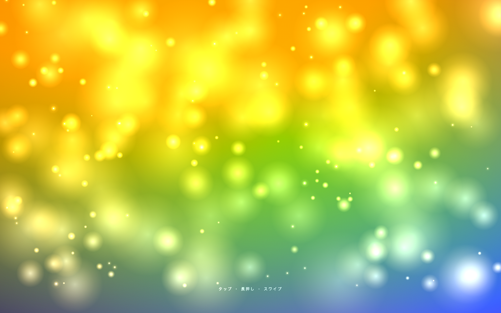
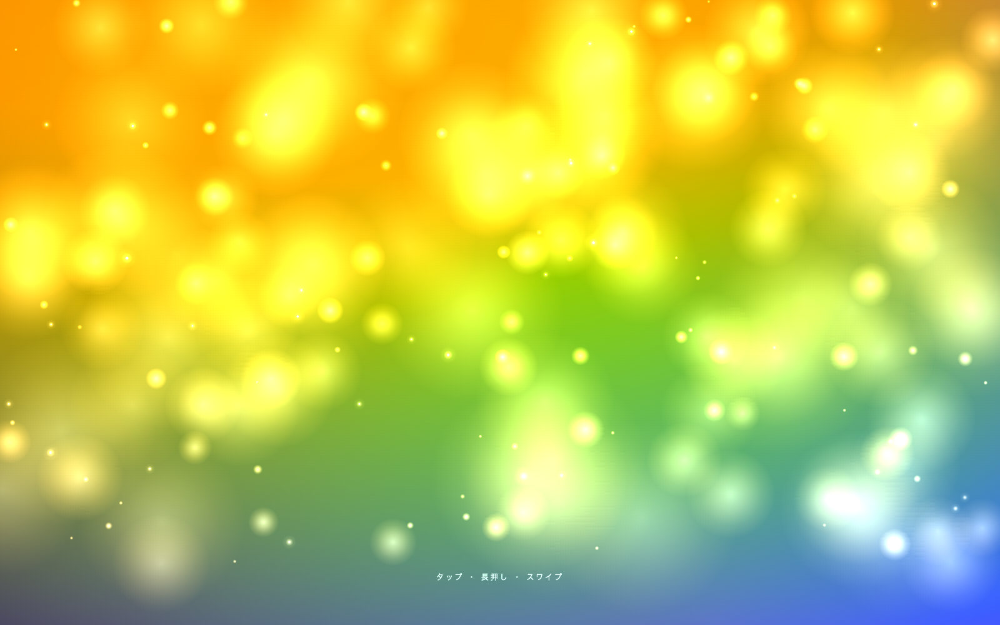
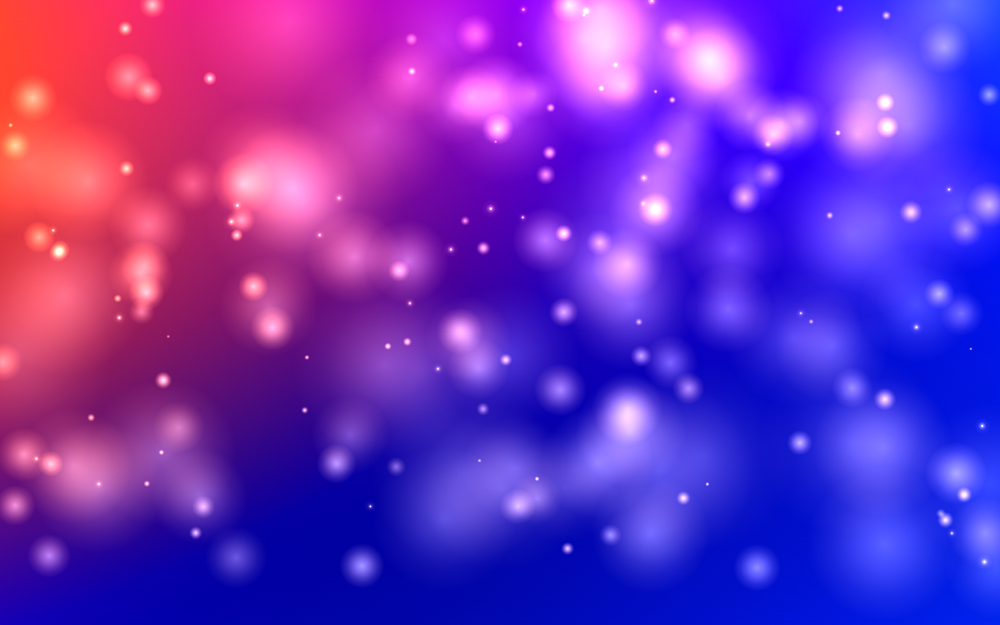

# Rainbow Bokeh

ゆらめく虹色のグラデーションの上を、光の粒が漂う。タップ・長押し・スワイプで光を集め、解き放つ — ブラウザだけで動く、触覚的なインタラクティブ Canvas。

<p align="center">
  <a href="https://yamadar.github.io/rainbow-bokeh/">
    
  </a>
</p>

<p align="center">
  <strong>▶ ライブデモ: <a href="https://yamadar.github.io/rainbow-bokeh/">yamadar.github.io/rainbow-bokeh</a></strong><br>
  <sub>スマートフォン・PC どちらでも、開いた瞬間から遊べます</sub>
</p>

## 楽しみかた

| 操作 | 起こること |
| --- | --- |
| **タップ** | 触れた場所から波紋が広がり、光の粒を弾き飛ばす |
| **長押し** | 周囲の光がポインタに引き寄せられ、明るく輝く |
| **スワイプ** | 指の流れに沿って光がたなびく |

長押しでじっくりエネルギーを溜めてから離すと、より大きな波紋が放たれます。

## 表情のバリエーション

背景の色相は約 45 秒かけてゆっくり一巡します。開くタイミングで、まったく違う雰囲気に出会えます。

<p align="center">
  
  &nbsp;
  
</p>

## 仕組み

Vite 6 + バニラ JavaScript の小さな SPA です。Canvas 2D 上で粒子の物理（引力・フリック・波紋）を毎フレーム積分し、`mix-blend-mode: plus-lighter` で背景の虹色グラデーションと合成しています。実行時の依存はゼロ。

- 純粋ロジック（粒子生成 / ポインタ状態機械 / 物理）は DOM 非依存に切り出され、Vitest で 36 件のユニットテストが走ります
- `main.js` は DOM 配線と rAF ループだけの薄いエントリ
- 詳しいモジュール構成は [`docs/ARCHITECTURE.md`](./docs/ARCHITECTURE.md) を参照

## 手元で動かす

```bash
npm install
npm run dev      # http://localhost:5184/ が自動で開きます
npm test         # Vitest
npm run build    # dist/ へ静的ビルド
npm run format   # Prettier
```

`main` への push で GitHub Pages へ自動デプロイされます（[`.github/workflows/deploy.yml`](./.github/workflows/deploy.yml)）。

## ライセンス

[MIT](./LICENSE)
